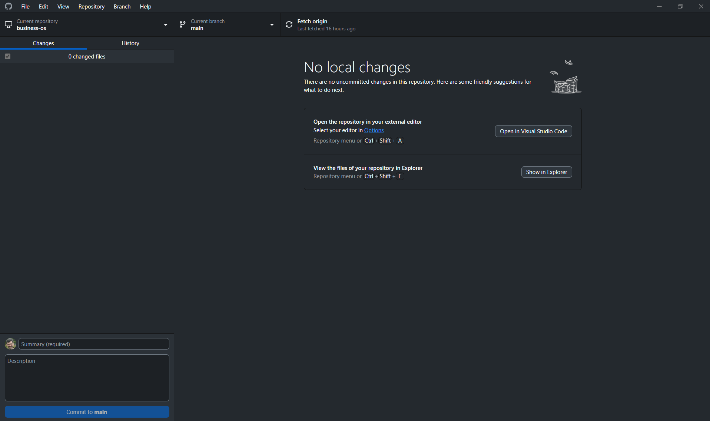
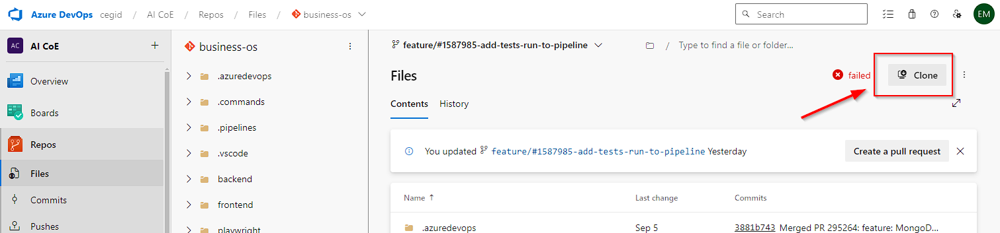
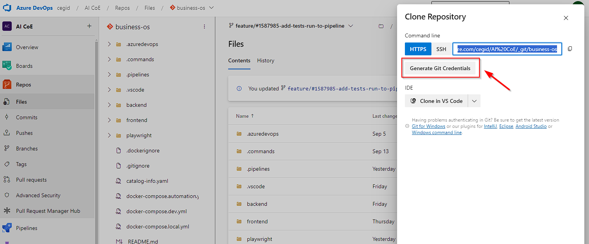
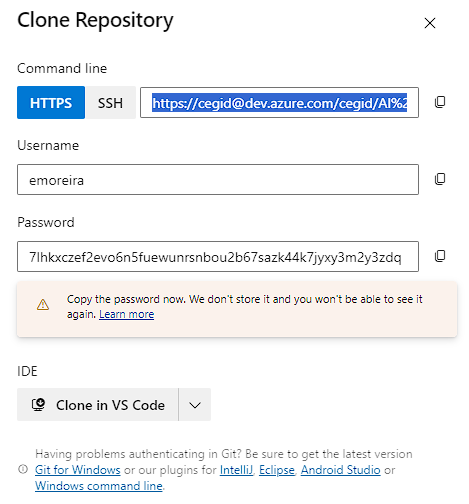

# GitHub Desktop

## Table of Contents
- [GitHub Desktop](#github-desktop)
  - [Table of Contents](#table-of-contents)
  - [Introduction](#introduction)
  - [How to merge main branch to a feature branch](#how-to-merge-main-branch-to-a-feature-branch)
  - [How to update credentials to access remote repository](#how-to-update-credentials-to-access-remote-repository)

## Introduction
Explain how to use the most usual things on GitHub Desktop

## How to merge main branch to a feature branch

On the top of with there are 3 buttons:
- Current repository - Represent the repository where we are working on
- Current branch - Active branch at the moment
- Action - Quick access to a action 

During the development of a feature, we should update the feature branch from main, periodically to minimize possible conflicts, that could be hard to solve.

To merge a feature branch from main the steps are :
- Switch to main branch 
- Fetch origin 
- Make pull, if necessary, to update local copy of main branch 
- Switch to feature branch 
- On menu branch, click on Update from main (Ctrl + Shift + U)
- If there are conflicts on the merge a pop-up window will show that 
- Click to open with software of preference (vscode)
- Solve conflict(s) manually
- When all conflicts are solved, on the pop-up menu click on Merge

## How to update credentials to access remote repository

- Access repository on Azure repos ([business-os repository](https://dev.azure.com/cegid/AI%20CoE/_git/business-os))
- Click on "Clone" button (on top right of the screen)
  
- Click on "Generate Git Credentials" button
  
- A username and password will be shown 
  
  

[< Go back](./Index.md)