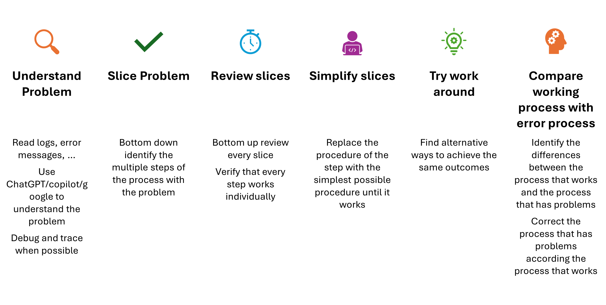

# Process

## Table of Contents
- [Process](#process)
  - [Table of Contents](#table-of-contents)
  - [Context](#context)
  - [Problems happening](#problems-happening)

## Context

## Problems happening

During the process of research and/or development some problem(s) could happen. 
When a problem occurs is necessary to understand that problem. To do that, is necessary to do some things like:
  1. Read logs
  2. Read error messages 
  3. Try to find the problem using 
     1. Debug
     2. Trace
     3. ChatGPT
     4. GitHub Copilot
     5. Google  

After understand what is happening:

1. Slice the process into steps to be easier to identify where the problem is happening.
2. Try to reproduce each step in a bottom-up way to be more clearly where is necessary to be focus
3. Simplify more and more the step where the process exists 
4. Find others ways to achieve the same outcome
5. Compare both processes

[Go Back](./Index.md)

